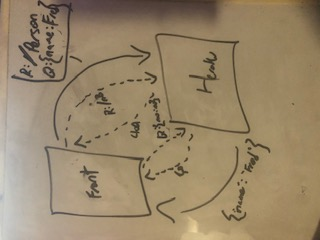
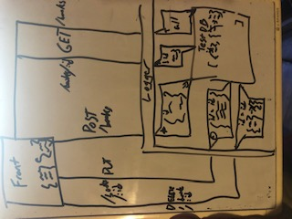
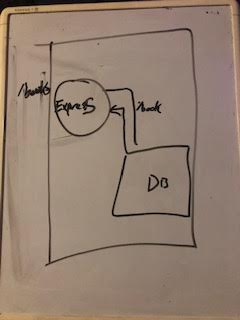

### LAB - Class 04

## Project: Lab 02/03/04
## Author: Julien Edwards

### Links and Resources

02

- [github](https://github.com/TrunkOfUkuleles/basic-express-server/pull/2)
- [Testing](https://github.com/TrunkOfUkuleles/basic-express-server/actions/runs/769292720) 

03
- [github](https://github.com/TrunkOfUkuleles/basic-express-server/pull/3)
- [Testing](https://github.com/TrunkOfUkuleles/basic-express-server/actions) 

04
- [github](https://github.com/TrunkOfUkuleles/api-server/pull/1)
- [Testing](https://github.com/TrunkOfUkuleles/api-server/actions) 

### Setup

#### `.env` requirements (when applicable)

- `PORT` = 3000 || 3333
- `MONGODB_URI` = mongodb://localhost:27017/books

#### How to initialize/run your application (where applicable)

- `npm run start`

#### Tests

- TDidn't even get to testing

#### UML / Application Wiring Diagram

Link to an image of the UML for your application and response to events

02

03

04

